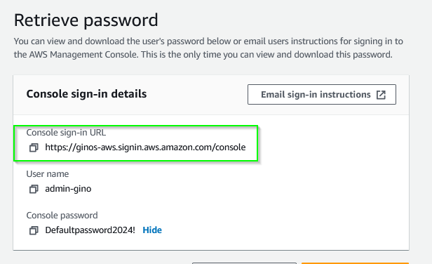

# Week 0 — Billing and Architecture

### Homework Challenges

1. Destroy root account credentials, MFA and IAM role
Login to the AWS console and navigate tothe 'IAM service'

Since my root user already has MFA, I'll create a new user and set up MFA on that account. 

I'll start by creating a user 
Access management -> Users -> Create user

Then I'll name the account, provide console access, and set the password. 
When dealing with passwords I like to issue a password and then require the user to change it upon sign in. 
ex. using 'Defaultpassword2024!'

I'll assign this user with admin access since I'll be using this user for the rest of the class. 

Then I'll create the user.

Now I'll navigate to the console sign in URL to sign in, change password and set up MFA on this account 

Here ill change the password

I'll then navigate to the security credentials and add google authenticater as my MFA device. 

Now that I have a new user with Admin access I won't have to login as my root user. 

2. Use EventBridge to hookup health Dashboard to SNS and send notification when there is a service issue.

3. Review all the questions of each pillars in the Well Architected Tool.

4. Create an architectual diagram of the CI/CD logical pipeline.

5. Research the techincal and service limits of specific services and how they could impact the techincal path for techincal flexability.

6. Open a support ticket and request a service limit.